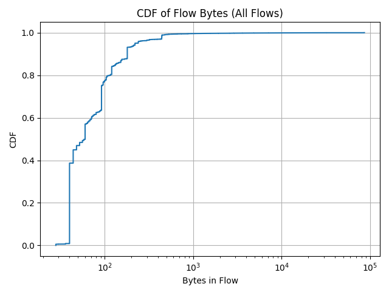
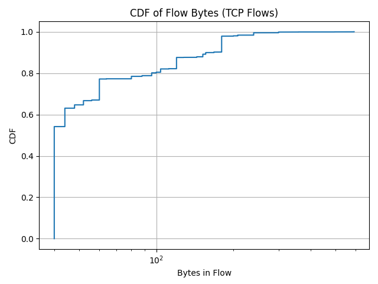
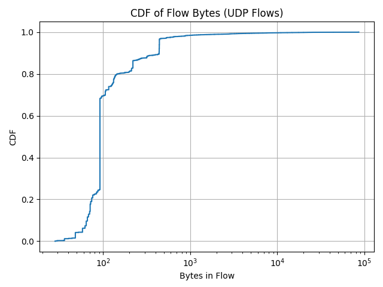
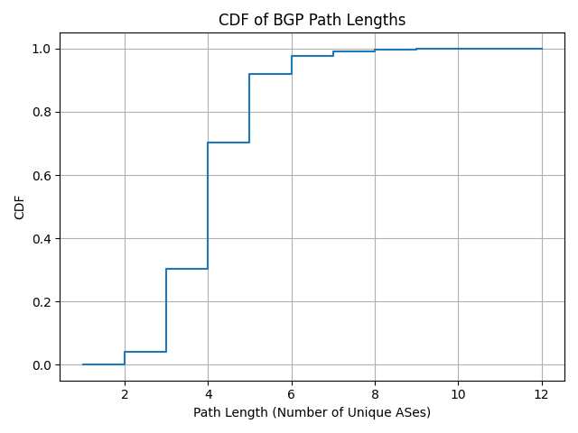
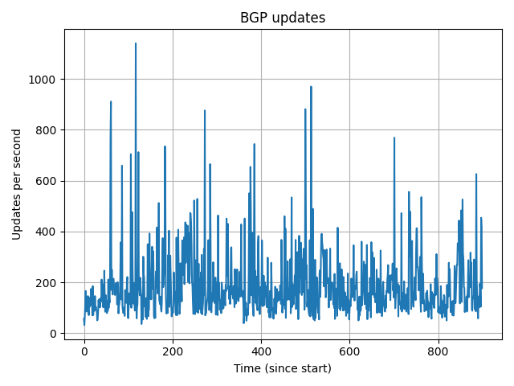
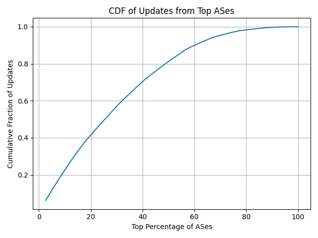

## README
There are two scripts for this assignemnt.
1. netflow.py (Part 1)
2. bgp.py (Part 2)

Place these scripts in the same root folder as the csv files. This is already set up in the submission zipfile. The requirements and virtual environment are listed below. After installing Python, you can simply run `pip install numpy pandas matplotlib` through the command line to cover all dependencies.
1. Python 3.13.1
``` 
contourpy==1.3.2
cycler==0.12.1
fonttools==4.57.0
kiwisolver==1.4.8
matplotlib==3.10.1
numpy==2.2.5
packaging==25.0
pandas==2.2.3
pillow==11.2.1
pyparsing==3.2.3
python-dateutil==2.9.0.post0
pytz==2025.2
six==1.17.0
tzdata==2025.2
```
Run the scripts with the following commands in the root submission directory.
```zsh
python netflow.py
python bgp.py
```

## Question 1.1





### Observations
1. We see a heavy-tailed distribution, where around 50% of all flows are under 300 B and 90% are under 1000 B, with only a few flows being larger than 10 kB. We can conclude that most flows are quite small.
2. There are many more small-sized TCP flows than UDP flows, likely from the handshake and ACK packets without payloads in TCP.

## Question 1.2
### Top 10 Source IPs by flows:
1. 116.211: 17019 flows
2. 169.54: 9424 flows
3. 222.186: 5269 flows
4. 163.53: 2981 flows
5. 169.45: 2494 flows
6. 94.23: 2205 flows
7. 141.212: 2143 flows
8. 212.83: 2042 flows
9. 64.125: 1852 flows
10. 184.105: 1775 flows

Percentage of flows from top 10 source IPs: 44.80%

### Top 10 Source IPs by bytes:
1. 212.83: 928311 bytes
2. 169.54: 867928 bytes
3. 116.211: 680922 bytes
4. 140.205: 510833 bytes
5. 128.112: 506604 bytes
6. 42.120: 326122 bytes
7. 169.45: 229448 bytes
8. 222.186: 211068 bytes
9. 5.8: 126940 bytes
10. 163.53: 120920 bytes

Percentage of bytes from top 10 source IPs: 37.41%

## Question 1.3
Port 443: HTTPS
Percentage of flows from port 443: 1.10%
Percentage of flows to port 443: 4.40%

## Question 1.4
Percentage of total bytes sent by 128.112: 4.20%
Percentage of total bytes received by 128.112: 95.95%
Percentage of bytes both sent and received by 128.112: 0.84%

We see an extreme imbalance in byte-counts on this router's network, specifically almost all bytes received being destined to 128.112.0.0/16, but very few being sent from it, and almost no fully internal bytes. This router is acting as a net sink of traffic, perhaps for one of the research universities in Internet2, where end hosts primarily download or request content from out-of-network servers and rarely upload.

## Question 1.5
I imagine that most of the work people do at a busy public cafe during the afternoon consists of web-based downloads and uploads, as well as video and music streaming. I would expect the following changes to the collected data:
1. The flow CDF shifting to the right, as video and music streaming requires larger multimedia flows and larger/more packets.
2. Assuming the cafe has a NAT, we would likely see most of the top 10 source IPs for traffic to be under the same /16 prefix.
3. HTTPS to dominate the destination port traffic in a much more significant way than it does currently, because typical browser traffic is through HTTPS.
4. I would still expect the inbound/outbound traffic split to lean more inbound-heavy, but it will likely be more balanced if cafe users are uploading. We might also see some more internal traffic (src and dst within the /16 network) if the cafe is streaming to a smart-speaker music system or using a printer.

## Question 2.1
Top 10 AS numbers by frequency:
1. AS3356: 95483 occurrences
2. AS3257: 75208 occurrences
3. AS1299: 64771 occurrences
4. AS6939: 56413 occurrences
5. AS2914: 54290 occurrences
6. AS37100: 45399 occurrences
7. AS174: 45319 occurrences
8. AS49788: 41468 occurrences
9. AS3130: 38180 occurrences
10. AS3303: 36486 occurrences

Percentage of top 10 AS numbers in all paths: 78.79%

AS3356: LEVEL3 - United States
AS3257: GTT-BACKBONE GTT - United States
AS1299: TWELVE99 Arelion, fka Telia Carrier - Sweden
AS6939: HURRICANE - United States
AS2914: NTT-DATA-2914 - United States
AS174: COGENT-174 - United States
AS37100: SEACOM-AS - Mauritius
AS49788: NEXTHOP - Norway
AS3130: RGNET-SEA RGnet Seattle Westin - Estonia
AS3303: SWISSCOM Swisscom Switzerland Ltd - Switzerland

It might be problematic for an AS to be commonly found in these routes because it means that the AS is responsible for handling a very significant portion of the internet traffic. Since these ASes are critical for internet operation, a failure across any one of them could have a large effect on the rest of the internet. Many other ASes would need to re-converge to a new stable path, assuming one exists, which may result in some internet downtime as the BGP protocol runs.

## Question 2.2


This tells us that most paths across the internet are short (between 3 and 6 hops). We can infer that the internet's AS-level topology is relatively flat since the destination can be reached so efficiently. There are rare occurances of greater than 10 AS hops. 

## Question 2.3
Average updates per minute: 10391.19



## Question 2.4



The steep rise at the beginning of the CDF graph indicates that a small top percentage of ASes are responsible for a large portion of the BGP updates. The curve flattens out as it approaches 100%, meaning that the remaining ASes send updates much less frequently. Those select few highly active ASes are likely less stable (perhaps due to frequent route changes or network reliability issues), while the remaining majority that infrequently update are part of a more stable network.